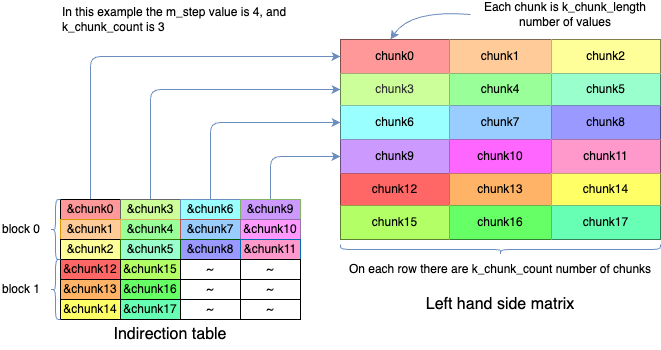

<!--
    SPDX-FileCopyrightText: Copyright 2025 Arm Limited and/or its affiliates <open-source-office@arm.com>

    SPDX-License-Identifier: Apache-2.0
-->

# How to run the indirect matmul micro-kernels

The goal of this document is to give an overview of the steps needed to run an
indirect `matmul`, denoted `imatmul`, micro-kernel. The example is using the following
micro-kernels.

- `imatmul_clamp_f16_f16p2vlx2_f16p2vlx2_2vlx2vl_sme2_mopa`
- `lhs_imatmul_pack_x16p2vlx2_x16p_sme`
- `rhs_imatmul_pack_kxn_x16p2vlx2b_x16_x16_sme`

## Prerequisites

To be able to use the micro-kernels in this example you need to have the
following includes:

```cpp
#include "kai_imatmul_clamp_f16_f16p2vlx2_f16p2vlx2_2vlx2vl_sme2_mopa.h"
#include "kai_lhs_imatmul_pack_x16p2vlx2_x16p_sme.h"
#include "kai_rhs_imatmul_pack_kxn_x16p2vlx2b_x16_x16_sme.h"
```

## Background

The difference between direct `matmul` and the `imatmul` is mainly in the view
of the K dimension of the matrix multiplication. The `matmul` doesn't pose any
restrictions on the K dimension, whereas the `imatmul` needs the K dimension to
be evenly divided into chunks. This is reflected in the API as `k_chunk_count`
being the number of chunks, and `k_chunk_length` being the length, in elements,
of each chunk.

Additionally, the left hand side operand is a table of chunk pointers rather
than a table of values. This is the indirection part of the `imatmul`.

## Use case

The benefit of using the `imatmul` micro-kernels is that they allow much more
efficient representations of convolutions by filters with shapes larger than
1×1. For a walk through of this, please refer to the fp16 example of the
`imatmul` micro-kernel.

## Packing

The major difference between the normal `matmul`, and the `imatmul` flow is the
left hand side packing.

### Left hand side packing

The rows of the left hand side matrix are split into chunks, where each chunk is
`k_chunk_length` number of values, and on each row there are `k_chunk_count`
number of chunks. This will be referred to by an indirection table, a table of
pointers, where each row will refer to a column of `m_step` chunks, as
illustrated by the below example.

The left hand side packing micro-kernel operates on an indirection table, a table of
pointers to chunks, where each chunk contains `k_chunk_length` number of values.
The layout of this table is a bit special, to allow linear memory access of the
table entries. The memory layout is a row major table, where each row has M-step
number pointers. This is illustrated in the figure below.



The indirection table can use two types of pointers, chunk pointers and padding
pointers. The difference between these two pointers is that the function
argument `lhs_ptr_offset` will not be added to padding pointers. The reason for
this distinction is that padding chunks can live outside of the left hand side
matrix, and you can use the base address of the left hand side matrix as
`lhs_ptr_offset` with `lhs_ptrs` being a table of indices rather than pointers.

A simple flow of invoking the left hand side packing could look like the
following.

The following values are used to describe the input data.

```cpp
/* Values used for the LHS packing */
size_t m, k_chunk_count, k_chunk_length;
float16_t *lhs_ptr;  // matrix of m * (k_chunk_count * k_chunk_length) values
```

Using the symbols above you can populate the indirection table using something
like the below code.

```cpp
/* Indirection table setup */
const size_t m_step = kai_get_m_step_lhs_imatmul_pack_x16p2vlx2_x16p_sme();
const size_t itable_rows = k_chunk_count * round_up_division(m, m_step);
const size_t itable_cols = m_step;

/* Allocate the indirection table */
float16_t **const itable = new float16_t *[itable_rows * itable_cols];

/* Populate the indirection table */
size_t chunk = 0;
for (size_t itable_block = 0; itable_block < itable_rows; itable_block += k_chunk_count) {
  for (size_t block_col = 0; block_col < itable_cols; block_col += 1) {
    for (size_t block_row = 0; block_row < k_chunk_count; block_row += 1) {
      /* Note that this will set values for all entries, even unused entries */
      const size_t idx = (itable_block + block_row) * itable_cols + block_col;
      itable[idx] = lhs_ptr + k_chunk_length * chunk++;
    }
  }
}
```

Using the indirection table above, you can then invoke the left hand side
packing micro-kernel using.

```cpp
const size_t lhs_packed_size = kai_get_lhs_packed_size_lhs_imatmul_pack_x16p2vlx2_x16p_sme(m, k_chunk_count, k_chunk_length);
std::byte *lhs_packed = new std::byte[lhs_packed_size];
kai_run_lhs_imatmul_pack_x16p2vlx2_x16p_sme(m, k_chunk_count, k_chunk_length, itable, 0, nullptr, lhs_packed);
```

### Right hand side packing

The right hand side packing for `imatmul` is very similar to the normal right
hand side packing. The difference is that the resulting layout will be suitable
for the layout used by the left hand side packing. Similar to the left hand side
packing the right hand side packing also takes `k_chunk_count` and
`k_chunk_length` arguments.

Same as for left hand side, set up values describing the input data.

```cpp
size_t n, k_chunk_count, k_chunk_length;
float16_t *rhs;   // Matrix of (k_chunk_count * k_chunk_length) * n values
float16_t *bias;  // vector of n values
```

Then allocate output buffer, and invoke the right hand side packing
micro-kernel.

```C++
const size_t rhs_packed_size = kai_get_rhs_packed_size_rhs_imatmul_pack_kxn_x16p2vlx2b_x16_x16_sme(n, k_chunk_count, k_chunk_length);
std::byte *rhs_packed = new std::byte[rhs_packed_size];
kai_run_rhs_imatmul_pack_kxn_x16p2vlx2b_x16_x16_sme(n, k_chunk_count, k_chunk_length, n * sizeof(float16_t), bias, rhs_packed);
```

## `imatmul`

Once the input data has been pack, as per description above the next step is
simply to invoke the `imatmul` micro-kernel.

Similarly to the invocations above, you need some parameters representing your
input. You need to allocate memory for output, and you need to invoke the
`imatmul` micro-kernel.

```cpp
size_t m, n, k_chunk_count, k_chunk_length;

const size_t dst_size = kai_get_dst_size_imatmul_clamp_f16_f16p2vlx2_f16p2vlx2_2vlx2vl_sme2_mopa(m, n);
float16_t* dst = new float16_t[dst_size / sizeof(float16_t)];

kai_run_imatmul_clamp_f16_f16p2vlx2_f16p2vlx2_2vlx2vl_sme2_mopa(m, n, k_chunk_count, k_chunk_length,
                                                                lhs_packed, rhs_packed, dst,
                                                                m * sizeof(float16_t), -1.0f, 1.0f);
```
