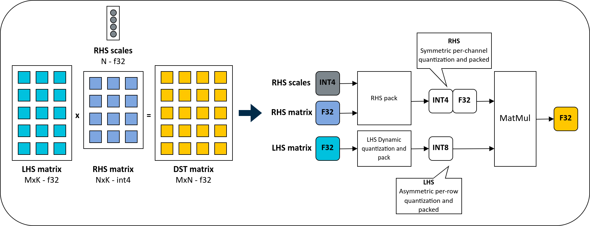

<!--
    SPDX-FileCopyrightText: Copyright 2024 Arm Limited and/or its affiliates <open-source-office@arm.com>

    SPDX-License-Identifier: Apache-2.0
-->

# How to run the int4 matmul micro-kernels

## Prerequisities

- Understanding of matrix multiplication routines
- Knowledge of quantization schemes, such as 8-bit (int8) per-channel quantization
- Experience with Arm® cross-compilation on Linux® or Android™
- Proficiency with Linux® commands

## Goal

In this guide, we will explore the use of the integer 4-bit (int4) matrix multiplication (matmul) micro-kernel with the per-channel quantization (cx).

## Target Arm® CPUs

Arm® CPUs with <strong>FEAT_I8MM</strong> extension.

## Introduction

In this guide, we will perform matrix multiplication between two matrices with the following data types and dimensions:

- Left-hand side (**LHS**) matrix: with `M` rows and `K` columns and with `f32` data type
- Right-hand side (**RHS**) matrix: with `N` rows and `K` columns and with quantized (`q`) symmetric (`s`) signed 4-bit (`i4`) with per-channel quantization (`cx`)

Since the **RHS** matrix uses symmetric per-channel quantization, it is accompanied by an additional array (`RHS scales`) containing the scale quantization parameters for each `N` value.

> ℹ️ The quantization is called per-channel because matrix multiplication is commonly used to accelerate the convolution layer and the `N` dimension corresponds to the `output channel`, for example, `C` in `NHWC`.

The following image visually describes the operations involved to perform this matrix multiplication type:


As you can see from the preceeding image, the LHS matrix is dynamically quantized to int8.

> ℹ️ In the previous image you can also see that both the LHS and RHS matrices are packed. This type of operation will be introduced later in the guide.

The int4 matmul per-channel micro-kernels are all available in the **[matmul_clamp_f32_qai8dxp_qsi4cxp](../../kai/ukernels/matmul/matmul_clamp_f32_qai8dxp_qsi4cxp/)** folder.

The specific micro-kernel variant we will be running in this guide is **[kai_matmul_clamp_f32_qai8dxp4x8_qsi4cxp8x8_8x8x32_neon_i8mm](../../kai/ukernels/matmul/matmul_clamp_f32_qai8dxp_qsi4cxp/kai_matmul_clamp_f32_qai8dxp4x8_qsi4cxp8x8_8x8x32_neon_i8mm.c)**.

The filename might seem intimidating at first glance. However, the filename actually describes what the micro-kernel accomplishes. So, our first step is to dissect it to better understand how the computation is executed.

### Dissecting the micro-kernel filename

The first part of the filename indicates that the micro-kernel comprises **matrix multiplication (`matmul`)** followed by a **clamp (`clamp`)** operation.

Following the operation performed, we encounter a list of matrices utilized for matrix multiplication, including the following:

- The destination matrix: `f32` type
- The left-hand side (LHS) matrix: quantized (`q`) asymmetric (`a`) signed 8-bit (`i8`) with per-dimension quantization (`dx`) type
- The right-hand side (RHS) matrix: quantized (`q`) symmetric (`s`) signed 4-bit (`i4`) with per-channel quantization (`cx`)

Subsequently, the filename provides information about the 2D output block size processed (`8x8`) and the number of accumulations performed by the single innermost for loop (`x32`). The filename concludes with details about the technology used (`neon`) and the Arm® extension exploited (`i8mm`).

You might have observed that the LHS and RHS matrices also include additional information starting with the letter `p`. When encountering the letter `p`, it indicates that the matrix is **packed**, meaning it needs to be transformed to facilitate computation.

### How do we pack the LHS and RHS matrices?

In the header of the matrix multiplication micro-kernel we report the additional micro-kernels required to leverage the computation. For this specific case, the additional micro-kernels are the following:

- [kai_lhs_quant_pack_qai8dxp_f32](../../kai/ukernels/matmul/pack/kai_lhs_quant_pack_qai8dxp_f32.c)
- [kai_rhs_pack_kxn_qsi4cxp_qs4cxs1s0](../../kai/ukernels/matmul/pack/kai_rhs_pack_kxn_qsi4cxp_qs4cxs1s0.c) or [kai_rhs_pack_nxk_qsi4cxp_qs4cxs1s0](../../kai/ukernels/matmul/pack/kai_rhs_pack_nxk_qsi4cxp_qs4cxs1s0.c)

The **kai_lhs_quant_pack_qai8dxp_f32** micro-kernel performs the dynamic quantization of the LHS matrix from f32 to int8 and packs the value to improve the cache locality during the matrix multiplication routine.
Instead, the **kai_rhs_pack_nxk_qsi4cxp_qs4cxs1s0 or kai_rhs_pack_kxn_qsi4cxp_qs4cxs1s0** packs the original integer 4-bit RHS matrix to improve the cache locality during the matrix multiplication routine.

The packing arguments required to run the preceeding micro-kernels, such as **mr**, **kr**, and **sr**, are obtained using the helper methods provided in the matrix multiplication micro-kernel.

At this point, it should be clear that matrix multiplication with int4 per-channel quantization requires three micro-kernels:

- Two micro-kernels for packing the LHS and RHS matrices
- One micro-kernel to perform matrix multiplication

Now that we know all the components for performing matrix multiplication, let's see how we can execute the micro-kernels.

## Running the micro-kernel

Create a new C project with an empty `main()` function using your favourite IDE:

```c
int main(int argc, char** argv) {
    return 0;
}
```

Then, perform the following steps to run the int4 matmul micro-kernel on an Arm® CPU with i8mm extension. Consider RHS is n x k format.

### Step 1

Include the micro-kernels' headers files:

```c
#include "kai_lhs_quant_pack_qai8dxp_f32.h"
#include "kai_rhs_pack_nxk_qsi4cxp_qs4cxs1s0.h"
#include "kai_matmul_clamp_f32_qai8dxp4x8_qsi4cxp8x8_8x8x32_neon_i8mm.h"
```

Since the int4 matmul micro-kernel requires both the LHS and RHS to be packed, performing the matrix multiplication requires three micro-kernels:

- Two micro-kernels for packing the LHS and RHS matrices
- One micro-kernel to perform the matrix multiplication

> ℹ️ Including the `kai_common.h` header file is not required. Nonetheless, as it is a dependency of the micro-kernel, its directory must be included in your build script.

### Step 2

Inside the `main()` function, declare and initialize three variables with the **M**, **N**, and **K** dimensions:

```c
    const size_t m = 13;
    const size_t n = 17;
    const size_t k = 18;
```

In the preceed code snippet, **M** is `13`, **N** is `17`, and **K** is `18`.

### Step 3

Allocate the memory for the LHS (f32) and RHS (int4) matrices, and the destination (f32) matrix:

```c
    const size_t lhs_native_size_f32 = m * k * sizeof(float);
    const size_t rhs_native_size_qs4cx = n * (k / 2) * sizeof(uint8_t);
    const size_t dst_size_f32 = m * n * sizeof(float);

    // Allocate the memory
    uint8_t* lhs_native_mtx_f32 = new uint8_t[lhs_native_size_f32];
    uint8_t* rhs_native_mtx_qs4cx = new uint8_t[rhs_native_size_qs4cx];
    uint8_t* dst_mtx_f32 = new uint8_t[dst_size_f32];
```

As the micro-kernel does not handle memory allocation, it is the user's responsibility to allocate memory for all matrices and manage their lifetimes.

> ℹ️ When calculating the size of thr RHS matrix, you need to consider how the 4-bit values are stored. Specifically, since two 4-bit values are held in one 8-bit value, we need to adjust the size accordingly by dividing the `k` dimension by `2`.

### Step 4

Allocate the memory for the RHS scales:

```c
    const size_t rhs_scales_size_f32 = n * sizeof(float);

    uint8_t* rhs_scales_f32 = new uint8_t[rhs_scales_size_f32];
```

The RHS matrix is quantized (`q`) symmetric (`s`) with per-channel quantization (`cx`). Therefore, we have one scale factor for each output channel (`n`).

### Step 5:

Allocate the memory for the LHS and RHS packed matrices:

```c
    // Get the packing parameters
    const size_t mr = kai_get_mr_matmul_clamp_f32_qai8dxp4x8_qsi4cxp8x8_8x8x32_neon_i8mm();
    const size_t nr = kai_get_nr_matmul_clamp_f32_qai8dxp4x8_qsi4cxp8x8_8x8x32_neon_i8mm();
    const size_t kr = kai_get_kr_matmul_clamp_f32_qai8dxp4x8_qsi4cxp8x8_8x8x32_neon_i8mm();
    const size_t sr = kai_get_sr_matmul_clamp_f32_qai8dxp4x8_qsi4cxp8x8_8x8x32_neon_i8mm();

    // Get the size in bytes for the packed matrices
    const size_t lhs_packed_size = kai_get_lhs_packed_size_lhs_quant_pack_qai8dxp_f32(m, k, mr, kr, sr);
    const size_t rhs_packed_size = kai_get_rhs_packed_size_rhs_pack_nxk_qsi4cxp_qs4cxs1s0(n, k, nr, kr, sr);

    // Allocate the matrices
    uint8_t* lhs_packed_mtx_qa8dx = new uint8_t[lhs_packed_size];
    uint8_t* rhs_packed_mtx_qs4cx = new uint8_t[rhs_packed_size];

```

In the preceding code snippet, we first use the helper methods of the int4 matmul micro-kernel to get the packing parameters (`mr`, `nr`, `kr`, and `sr`).
Then, we use the helper functions of the packing micro-kernels to know the size of the packed tensors (`lhs_packed_size` and `rhs_packed_size`).

> ℹ️ All micro-kernels have a helper method to return the size in bytes for the destination tensors/matrix.

Once we know the size of the packed matrices, we allocate the memory for the packed matrices.

### Step 6:

Assuming you have filled the native LHS and RHS matrices with some random values, perform the RHS packing:

```c
    struct kai_rhs_pack_nxk_qsi4cxp_qs4cxs1s0_params params;
    params.lhs_zero_point = 1;
    params.rhs_zero_point = 8;

    // RHS packing
    kai_run_rhs_pack_nxk_qsi4cxp_qs4cxs1s0(
        1, n, k, nr, kr, sr,                    // Packing arguments
        (const uint8_t*)(rhs_native_mtx_qs4cx), // RHS
        NULL,                                   // Bias
        (const float*)(rhs_scales_f32),         // Scale
        rhs_packed_mtx_qs4cx,                   // RHS packed
        0, &params);
```

Since the RHS matrix commonly keeps the weights of the trained model, you should perform this operation only once and free the memory of the native RHS matrix if not used elsewhere.

### Step 7:

Convert the LHS matrix from f32 to integer 8-bit and pack the data:

```c
    kai_run_lhs_quant_pack_qai8dxp_f32(
        m, k, mr, kr, sr, 0,                    // Packing arguments
        (const float*)lhs_native_mtx_f32,       // LHS
        k * sizeof(float),                      // LHS stride
        lhs_packed_mtx_qa8dx);                  // LHS packed
```

Since the content of the LHS matrix changes at runtime, the LHS dynamic quantization and packing must be performed always before computing the matrix multiplication.

### Step 8:

Perform the matrix multiplication:

```c
    const size_t dst_stride = n * sizeof(float);
    kai_run_matmul_clamp_f32_qai8dxp4x8_qsi4cxp8x8_8x8x32_neon_i8mm(
        m, n, k,                            // Dimensions
        (const void*)lhs_packed_mtx_qa8dx,  // LHS packed
        (const void*)rhs_packed_mtx_qs4cx,  // RHS packed
        (float*)dst_mtx_f32,                // DST
        dst_stride,                         // DST stride (row)
        sizeof(float),                      // DST stride (column)
        -FLT_MAX, FLT_MAX);                 // Min and max for the clamp operation
```

### Step 9:

Free the dynamically allocated memory:

```c
    delete[] lhs_native_mtx_f32;
    delete[] rhs_native_mtx_qs4cx;
    delete[] dst_mtx_f32;
    delete[] rhs_scales_f32;
    delete[] lhs_packed_mtx_qa8dx;
    delete[] rhs_packed_mtx_qs4cx;
```

Now, write the build script to compile the example. If you are using CMake, your script might look like this:

```cmake
cmake_minimum_required(VERSION 3.16)

set(CMAKE_CXX_FLAGS "${CMAKE_CXX_FLAGS} -std=c++17")
set(KLEIDIAI_PATH ../../)
set(MATMUL_PACK_PATH ${KLEIDIAI_PATH}/kai/ukernels/matmul/pack/)
set(MATMUL_PATH ${KLEIDIAI_PATH}/kai/ukernels/matmul/matmul_clamp_f32_qai8dxp_qsi4cxp/)

# KleidiAI include directories
include_directories(
    ${KLEIDIAI_PATH}
    ${MATMUL_PACK_PATH}
    ${MATMUL_PATH})

# Files requires to build the executable
add_executable(matmul_clamp_f32_qai8dxp_qsi4cxp
    matmul_clamp_f32_qai8dxp_qsi4cxp.cpp
    ${MATMUL_PACK_PATH}/kai_rhs_pack_nxk_qsi4cxp_qs4cxs1s0.c
    ${MATMUL_PACK_PATH}/kai_rhs_pack_kxn_qsi4cxp_qs4cxs1s0.c
    ${MATMUL_PACK_PATH}/kai_lhs_quant_pack_qai8dxp_f32.c
    ${MATMUL_PATH}/kai_matmul_clamp_f32_qai8dxp4x8_qsi4cxp8x8_8x8x32_neon_i8mm.c)

# Compile with DotProd and I8MM features enabled
target_compile_options(matmul_clamp_f32_qai8dxp_qsi4cxp PRIVATE -march=armv8.2-a+dotprod+i8mm)
```

As you can see from the preceeding CMake script, we include the following directory paths:

- The KleidiAI root directory (`${KLEIDIAI_PATH}`)
- The matmul pack directory (`${MATMUL_PACK_PATH}`)
- The matmul with the int4 per-channel quantization directory (`${MATMUL_PATH}`)

Once you have prepared the build script, you can compile the project.

For example, to build the project for Android™, you can use the following commands in your terminal:

```bash
mkdir build && cd build

export NDK_PATH="your-android-ndk-path"

cmake -DCMAKE_TOOLCHAIN_FILE=${NDK_PATH}/build/cmake/android.toolchain.cmake -DANDROID_ABI=arm64-v8a -DANDROID_PLATFORM=android-23 -DCMAKE_C_FLAGS=-march=armv8.2a+i8mm -DCMAKE_CXX_FLAGS=-march=armv8.2a+i8mm ..

make
```

The Android™ NDK can be downloaded from [here](https://developer.android.com/ndk/downloads).

That’s all for this guide!

## To learn more

This guide is an adaptation of the **matmul_clamp_f32_qai8dxp_qsi4cxp** example available at this [link](../../examples/matmul_clamp_f32_qai8dxp_qsi4cxp/matmul_clamp_f32_qai8dxp_qsi4cxp.cpp).

In the **matmul_clamp_f32_qai8dxp_qsi4cxp** example, you will learn:

- How to quantize a f32 matrix to int4 adopting a per-channel quantization
- How to invoke different micro-kernel variants of the same type
