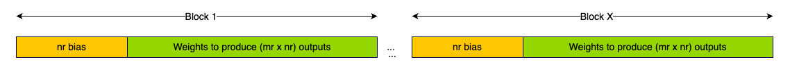
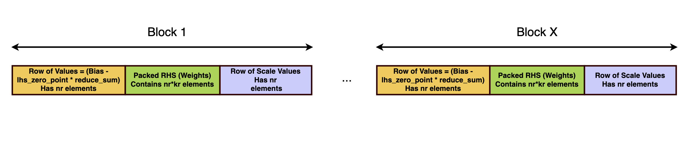

<!--
    SPDX-FileCopyrightText: Copyright 2024 Arm Limited and/or its affiliates <open-source-office@arm.com>

    SPDX-License-Identifier: Apache-2.0
-->

# About

Almost all matrix multiplication(matmul) micro kernels have some kind of packing involved with Right Hand Side (RHS) and/or Left Hand Side (LHS). They are done for performance
reasons. Here is a list of different packing micro-kernels that are used for matmul.

# Packing

For information about terminologies like mr, nr used here, please refer to the README in the main directory of the microkernel.

#### kai_run_rhs_pack_kxn_f16p16x1biasf16_f16_f16_neon()

Packs RHS(weights) and bias into X blocks that are a combination of RHS and bias. Details of the input are as below.

1. Bias for N elements
1. Non-transposed RHS of dimension KxN

The pattern of the packed output is shown below

 

Each block has bias and weights arranged as expected by the micro kernel to produce a mr x nr output matrix. There can be padding involved in the blocks depending on the combination of underlying instruction used for the optimization in the micro kernel, the chosen values of mr and nr and input dimensions, M, N and K.

#### kai_run_rhs_pack_kxn_qsi8cxp2vlx4sb_qs8cx_f32_i32_sme()

Pack RHS(weights), bias and scaling factor together into X number of blocks that are a combination of scale, bias and RHS. Details of the input are below.

1. Values calculated using the bias, reduce_sum and lhs_zero point such that;  Value\[n\] = Bias\[n\] - (lhs_zero_point * reduce_sum\[n\]). Each block has nr elements, including padding.
1. Non-transposed RHS of dimension KxN. Each block contains nr\*kr elements, including any padding.
1. Scale values calculated as Scale\[n\] = (rhs_scale\[n\] * lhs_scale) / dst_scale. Each block has nr elements, including any padding.

The pattern of the packed output is shown below.

 

Padding may be involved in the blocks depending on the values of mr, nr and kr and the input dimensions, M, N and K.

## Packing for int4 matmul micro-kernels

For optimal cache utilization, the operands are packed for the matmul operations. There are 2 types of packing functions used in int4 matmul micro-kernels:

### 1. Quantize and pack:

These packing routines are used with LHS operand of the matmul. It quantizes the input to int8 and packs them along with their scale (and offset values in asymmetric quantization) in the destination matrix.

#### kai_run_lhs_quant_pack_qsi8d32p_f32()

Quantize and pack LHS matrix with per-block quantization parameters.

Inputs

1. LHS matrix(M x K) with float (f32) input values and dimensions
1. Block length, mr, kr, sr and other parameters defines how to interleave multiple rows and split the rows in packing implementation.

Output

LHS packed matrix containing quantized (q) symmertric (s) signed int8 (i8) values, with block-wise quantization (d32p) parameters, i.e. the quantized elements are stored in blocks and each block has a scale factor.

#### kai_run_lhs_quant_pack_qai8dxp_f32()

Quantize and pack LHS matrix with per-dimension(row) quantization parameters.

Inputs

1. LHS matrix(M x K) with float(f32) input values and dimensions
1. mr, kr, sr and other parameters defines how to interleave multiple rows and split the rows in packing implementation.

Output

LHS packed matrix containing quantized (q) asymmertric (a) signed int8 (i8) values, with per-row (dx) quantization parameters, i.e. the scale factor is stored at the end of each row.

### 2. Pack:

These packing routines are used with RHS values. It takes 4-bit quantized unsigned int values, with their scales (and offset values in asymmetric quantization) and bias as inputs and packs them in the destination matrix. Optionally, reduction sums are also calculated and packed for each row/block as well.

#### kai_run_rhs_pack_nxk_qsi4c32pscalef16_qsu4c32s16s0()

Packs RHS matrix and bias with per-block quantization parameters.

Inputs

1. RHS matrix and dimensions. The input RHS matrix (N x K) has quantized (q) symmetric (s) 4-bit unsigned int (u4) values with per-block quantization (c32) parameters. The two int4 elements are packed in interleaved order (s16s0) i.e. two int4 values stored in one byte, where the lower order part of the byte (low) holds the low nibble (K-index + 0) and the higher order of the byte holds the high nibble (K-index + 16). Fp16 scale factors are stored at the beginning of each block.
1. Block length, mr, kr sr and other parameters defines how to interleave multiple rows and split the rows in packing implementation.
1. Bias for N elements

Output

RHS packed matrix (N x K) contains quantized (q) symmetric (s) 4-bit signed int (i4) values with per-block quantization (c32). Two int4 values are stored in one byte. Fp16 scale factors (scalef16) are stored at the end of each block.

#### kai_run_rhs_pack_nxk_qsi4cxp_qs4cxs1s0()

Packs RHS matrix and bias with per-channel quantization parameters.

Inputs

1. RHS matrix and dimensions. The input RHS matrix (N x K) has quantized (q) symmetric (s) 4-bit signed or unsigned int (4) values with per-channel quantization (cx) parameters. The two int4 elements are packed in sequential order (s1s0) i.e. two int4 values stored in one byte, where the lower order part of the byte (low) holds the low nibble (K-index + 0) and the higher order of the byte holds the high nibble (K-index + 1).
1. Block length, mr, kr sr and other parameters defines how to interleave multiple rows and split the rows.
1. Bias for N elements
1. Scale factors

Output

RHS packed matrix (N x K) contains quantized (q) symmetric (s) 4-bit signed int (i4) values with per-channel quantization (cx). Two int4 values are stored in one byte.

#### kai_run_rhs_pack_kxn_qsi4cxp_qs4cxs1s0()

Same as kai_run_rhs_pack_nxk_qsi4cxp_qs4cxs1s0() with the input RHS matrix dimensions as K x N.
